# CUDA C++ Best Practices Guide

## CP1. 这是一本可以指导编程者得到最佳性能的指南

## CP2. 这本书适合谁

1. 懂C++
2. CUDA 环境已经准备好

## CP3. 评估，并行化，优化，部署

先实现投资小收益高的优化并完成部署，之后在进行投入多收益小的优化，如此迭代。

比如现考虑延迟掩藏实现，部署完成，之后再考虑微调浮点操作序列。

非常重要的一点是这样做可以降低风险。

## CP4. 严格执行第三条

## CP5. 评估应用

看看哪里收益最高，制定几个 APOD 迭代计划。

## CP6. 异构计算

合理分配任务，最大化利用 CPU (HOST) 和 GPU (DEVICE) 的计算能力

### 6.1. 主机和设备的区别

下面是一些主要的区别，其他不同后面细聊。了解各自的特性让 CPU GPU 高效协同，提高效率是我们要做的。

#### 线程资源

CPU 的 core 数量有限，并行程度低。

GPU 的线程最小执行单元是一个线程束(warp, 包含32个线程)，现代 GPU 设备每个 SM 最多 2048 个线程处于活动状态，GPU 可能有 80 SM 甚至更多。

#### 线程

CPU 的线程是重实体，线程的上下文切换代价高

GPU 的线程是轻量化的，同一个 SM 上处于活动状态的线程有上千个甚至更多，而且线程间切换几乎免费，如果一个线程需要等待，执行其他线程来覆盖等待时间就可以了

总结，CPU 为了低延迟，GPU 为了高吞吐。

#### RAM

CPU GPU 有各自的内存，互相访问需要成本

### 6.2. DEVICE 上应该做哪些事

#### 设备上一般负责对大量数据作相同操作的工作

#### 减少 HOST-DEVICE 的数据传输

##### 执行更多计算

处理数据需要的操作数量 / 传输数据量 这个比值越大，收益越明显

##### 数据别传来传去

尽量避免数据反复在 HOST-DEVICE 传送，即使某个操作 GPU 没有 CPU 快，也极有可能不必将数据传回 CPU 操作。

##### 善用合并访存

按顺序（规律的）访存快太多了，避免随机存取，虽然GPU的随机存取比CPU强。

## CP7. 应用分析

### 7.1. 分析

使用率高的代码应该被优点关注到并且考虑优化。道理显而易见

#### 7.1.1. 创建概要文件

目的就是找到最费时间的那部分函数，找到**热点**和**瓶颈**。

分析要基于应用的实际工作环境和内容，别打偏了。

工具例如 GNU 的 gprof

#### 7.1.2. 定义热点

基于 APOD 的思路，我们先挑选几个罪魁祸首(最耗时)的函数优化，完成POD之后，再考虑下一批优化对象

##### 7.1.3. 理解 scaling

如果合适，不能并行的代码放在 CPU 运行

###### 7.1.3.1. Strong Scaling and Amdahl’s Law

处理器越多，速度越快的问题。Amdahl定律指定了串行程序的并行化部分所能期望的最大加速。

$$
S = \frac {1} {(1 - P) + \frac P N)}     {P: 可以并行化的代码部分所占的总串行执行时间的分数 \choose N: 运行并行代码部分的处理器数量}
$$

有时候，可以考虑是否可以花时间增加 P 值。

###### 7.1.3.2. Weak Scaling and Gustafson’s Law

增加处理器数量会使问题复杂化。

$$
S = N + (1 - P)(1 - N) {P: 可以并行化的代码部分所占的总串行执行时间的分数 \choose N: 运行并行代码部分的处理器数量}
$$

###### 7.1.3.3. Applying Strong and Weak Scaling

了解哪种类型的扩展最适用于应用程序是估计加速的重要部分。

对于某些应用程序，问题大小将保持不变，因此只适用于强缩放。一个例子是模拟两个分子如何相互作用，其中分子大小是固定的

对于其他应用程序，问题的大小将增长，以填满可用的处理器。示例包括将流体或结构建模为网格或网格以及一些蒙特卡罗模拟，其中增加问题的大小可以提高准确性

## CH8. 并行化你的应用

在确定了热点并完成了设定目标和期望的基本练习之后，开发人员需要并行化代码。根据原始代码的不同，这可以像调**用现有的gpu优化库**(如cuBLAS、cuFFT或Thrust)一样简单，也可以像**添加一些预处理器指令**作为并行编译器的提示一样简单。

另一方面，一些应用程序的设计将需要一些重构来暴露其固有的并行性。因为即使是CPU架构也需要暴露这种并行性，以改善或简单地维持顺序应用程序的性能，CUDA系列并行编程语言(CUDA c++， CUDA Fortran等)旨在使这种并行性的表达尽可能简单，同时在CUDA支持的gpu上进行操作，以实现最大的并行吞吐量

## CH9. 开始

并行化顺序代码有几个关键策略。虽然如何将这些策略应用于特定应用程序的细节是一个复杂且特定于问题的主题，但这里列出的一般主题适用于我们是否并行化代码以在多核cpu上运行或在CUDA gpu上使用

### 9.1. 并行库

如果合适，可以直接用 cuBLAS cuFFT 之类的库，thrust 是 CUDA 版的 STL，也很好用。

### 9.2. 编译时期的并行优化

给编译器 nvcc 提供并行优化提示，比如 #pragma unroll 之类的

### 9.3. Coding to Expose Parallelism

如果确实没有现成的库好用，那就自己写 CUDA 算子。当应用程序的大部分总运行时间花在代码的几个相对独立的部分时，这种方法是最直接的。

更难以并行化的是具有非常平坦的配置文件的应用程序——即，花费的时间相对均匀地分布在代码库的大部分上的应用程序。对于后一种应用程序，某种程度的代码重构以暴露应用程序中固有的并行性可能是必要的，但请记住，这种重构工作将倾向于使所有未来的架构受益，CPU和GPU都一样，因此，如果有必要的话，这是非常值得努力的

## CP10. 得到正确的答案

得到正确的答案显然是所有计算的主要目标。在并行系统上，可能会遇到在传统的面向串行的编程中通常不会遇到的困难。这些问题包括线程问题，由于计算浮点值的方式而产生的意外值，以及CPU和GPU处理器操作方式的差异所带来的挑战。本章探讨可能影响返回数据正确性的问题，并指出适当的解决方案

### 10.1. 验证

#### 10.1.1. 与参考值比较

和优化之前的值比较，例如 GTEST 的 EXPECT_FLOAT_EQ。用于验证数值结果的过程可以很容易地扩展到验证性能结果。我们希望确保我们所做的每个更改都是正确的，并且它提高了性能(以及提高了多少)。经常检查这些东西，作为我们周期性APOD过程的一个组成部分，将有助于确保我们尽快达到预期的结果。

#### 10.1.2. 单元测试

重要性不必多说，需要注意寻址问题

\_\_host__ \_\_device__ 同时修饰函数可能是比较好的选择：

CPU GPU 都可以调用，而且可以同时调用。

CPU上跑的函数总是让人更安心。

### 10.2. 调试

参考 https://developer.nvidia.com/debugging-solutions，其中三个：

#### NVIDIA® Nsight™ Systems

一款全系统性能分析工具，旨在将应用程序的算法可视化，帮助您选择最大的优化机会，并在计算机中的任意数量的cpu和gpu上进行有效的调整;从笔记本电脑到DGX服务器

#### cuda-gdb

提供无缝调试体验，允许您同时调试应用程序的CPU和GPU部分。在Linux或MacOS上从命令行、DDD或EMACS使用CUDA-GDB

#### NVIDIA Nsight Visual Studio Edition

异构计算的终极开发平台。使用强大的调试和分析工具。了解Eclipse版本和启用了Visual Studio版本的图形调试

### 10.3. Numerical Accuracy and Precision

不正确或意外的结果主要是由计算和存储浮点值的方式导致的浮点精度问题引起的。

https://developer.nvidia.com/content/
precision-performance-floating-point-and-ieee-754-compliance-nvidia-gpus.

### 10.3.1. FP32 vs FP64

浮点数的相等是误差在可接受的范围内

#### 10.3.2. 浮点数运算不满足结合律

由于浮点数的特性，计算顺序可能影响精度。

#### 10.3.3. IEEE 754 Compliance

除了一些小的例外，所有CUDA计算设备都遵循IEEE 754二进制浮点表示标准。这些例外在CUDA c++编程指南的功能和技术规范中有详细说明，可能导致与主机系统上计算的IEEE 754值不同的结果。关键的区别之一是融合乘加(FMA)指令，它将乘加操作合并到单个指令执行中。它的结果通常与分别进行这两种操作得到的结果略有不同

#### 10.3.4. x86 80-bit Computations

## CP11. 优化 CUDA 应用

在每一轮应用程序并行化完成后，开发人员可以继续优化实现以提高性能。由于可以考虑许多可能的优化，因此对应用程序的需求有一个很好的理解可以帮助使该过程尽可能顺利。然而，就整个APOD而言，程序优化是一个迭代过程(确定优化的机会，应用和测试优化，验证实现的加速，然后重复)，这意味着程序员没有必要在看到良好的加速之前花费大量时间记忆所有可能的优化策略。相反，策略可以随着学习而逐步应用

在每一轮应用程序并行化完成后，开发人员可以继续优化实现以提高性能。由于可以考虑许多可能的优化，因此对应用程序的需求有一个很好的理解可以帮助使该过程尽可能顺利

## CP12. 性能指标

当尝试优化CUDA代码时，了解如何准确地测量性能并理解带宽在性能测量中所起的作用是值得的。本章讨论如何使用CPU定时器和CUDA事件来正确测量性能。然后探讨带宽如何影响性能指标，以及如何减轻带宽带来的一些挑战

### 12.1. 计时

CUDA调用和内核执行可以使用CPU或GPU计时器计时。本节将讨论这两种方法的功能、优点和缺陷

#### 12.1.1. 用 CPU 计时器

大部分CUDA API函数是异步的，对于这些异步调用计时结束之前一定要 cudadevicesynchrize()

虽然也可以将CPU线程与GPU上的特定流或事件同步，但这些同步函数不适合用于除默认流以外的流中的定时代码。cudaStreamSynchronize()会阻塞CPU线程，直到所有之前发出到给定流的CUDA调用都完成。cudaEventSynchronize()阻塞，直到特定流中的给定事件被GPU记录。因为驱动程序可能会从其他非默认流中交错执行CUDA调用，所以其他流中的调用可能包含在计时中。

因为默认流，流0，显示了设备上工作的序列化行为(默认流中的操作只能在任何流中的所有先前调用完成后才开始;并且任何流中的后续操作都不能在它完成之前开始)，这些函数可以可靠地用于默认流中的计时

请注意，本节中提到的cpu到GPU的同步点意味着GPU处理管道中的停顿，因此应该谨慎使用，以尽量减少它们对性能的影响

#### 12.1.2. 用 CUDA GPU 计时器

CUDA事件API提供了创建和销毁事件的调用，记录事件(包括时间戳)，并将时间戳差异转换为以毫秒为单位的浮点值。

```cuda
cudaEvent_t start, stop;
float time;
cudaEventCreate(&start);
cudaEventCreate(&stop);
cudaEventRecord( start, 0 );
kernel<<<grid,threads>>> ( d_odata, d_idata, size_x, size_y,
NUM_REPS);
cudaEventRecord( stop, 0 );
cudaEventSynchronize( stop );
cudaEventElapsedTime( &time, start, stop );
cudaEventDestroy( start );
cudaEventDestroy( stop );
```

这里cudaEventRecord()用于将开始和停止事件放入默认流流0中。当设备到达流中的事件时，它将记录事件的时间戳。cudaEventElapsedTime()函数返回记录开始事件和停止事件之间经过的时间。该值以毫秒表示，分辨率约为半微秒。与此清单中的其他调用一样，它们的具体操作、参数和返回值在CUDA Toolkit参考手册中有描述。请注意，计时是在GPU时钟上测量的，因此计时分辨率与操作系统无关

### 12.2. 带宽

带宽——数据传输的速率——是影响性能的最重要的门控因素之一。几乎所有对代码的更改都应该考虑它们对带宽的影响。正如本指南的内存优化中所述，存储数据的内存选择、数据的布局方式和访问顺序以及其他因素会极大地影响带宽

为了准确地测量性能，计算理论带宽和有效带宽是有用的。当后者远低于前者时，设计或实现细节可能会减少带宽，并且后续优化工作的主要目标应该是增加带宽，在度量性能和优化收益时，使用计算的有效带宽作为度量标准。

#### 12.2.1. 理论带宽计算

理论带宽可以使用产品文献中提供的硬件规格来计算。例如，NVIDIA Tesla V100使用HBM2(双数据速率)RAM，内存时钟速率为877 MHz，内存接口为4096位宽，根据这些数据项，NVIDIA Tesla V100的峰值理论内存带宽为

$$
(0.877 × 10^9 × (4096/8) × 2) ÷ 10^9 = 898GB/s
$$

$$
(0.877 × 10^9 × (4096/8) × 2) ÷ 1024^3 = 836.4GB/s
$$

在这个计算中，内存时钟速率被转换为Hz，乘以接口宽度(除以8，将比特转换为字节)，再乘以2，因为数据速率是双倍的。最后，将该乘积除以109，将结果转换为GB/s

在启用ECC的GDDR内存的gpu上，可用DRAM减少了6.25%，以允许存储ECC位。与禁用ECC的相同GPU相比，为每个内存事务获取ECC位也减少了大约20%的有效带宽，尽管ECC对带宽的确切影响可能更高，并且取决于内存访问模式。另一方面，HBM2内存提供专用的ECC资源，允许无开销的ECC保护

#### 12.2.2. 有效带宽计算

有效带宽是通过计时特定的程序活动和了解程序如何访问数据来计算的。要做到这一点，请使用这个方程

$$
Effective bandwidth = (Br + Bw)÷ time
$$

这里，Br是每个内核读取的字节数，Bw是每个内核写入的字节数，时间以秒为单位

#### 12.2.3. 由可视化分析器报告的吞吐量

对于计算能力为2.0或更高的设备，可以使用Visual Profiler收集几种不同的内存吞吐量度量。可以在Details或Detail Graphs视图中显示以下吞吐量指标

* 请求的全局负载吞吐量
* 请求的全局存储吞吐量
* 全局负载吞吐量
* 全局存储吞吐量
* DRAM读吞吐量
* DRAM写吞吐量

请求的全局负载吞吐量 和 请求的全局存储吞吐量 值表示内核请求的全局内存吞吐量，因此对应于有效带宽计算中显示的计算获得的有效带宽

由于最小内存事务大小大于大多数字的大小，**内核所需的实际内存吞吐量可以包括内核不使用的数据的传输**对于全局内存访问，实际吞吐量由全局负载吞吐量和全局存储吞吐量值报告

重要的是要注意这两个数字都是有用的。实际内存吞吐量显示了代码与硬件限制的接近程度，并且将有效带宽或请求带宽与实际带宽进行比较，可以很好地估计由于内存访问的次优合并而浪费了多少带宽(参见对全局内存的合并访问)。对于全局内存访问，请求内存带宽与实际内存带宽的比较由全局内存负载效率和全局内存存储效率指标报告

## CH13. 内存优化

内存优化是性能最重要的方面。目标是通过最大化带宽来最大化硬件的使用。最好使用尽可能多的快速内存和尽可能少的慢速访问内存来提供带宽。本章讨论了主机和设备上的各种内存，以及如何最好地设置数据项以有效地使用内存

### 13.1. 主机与设备之间的数据传输

设备内存和GPU之间的峰值理论带宽(例如NVIDIA Tesla V100上的898 GB/s)远高于主机内存和设备内存之间的峰值理论带宽(PCIe x16 Gen3上的16 GB/s)。因此，为了获得最佳的整体应用程序性能，尽量减少主机和设备之间的数据传输是很重要的，即使这意味着在GPU上运行内核与在主机CPU上运行内核相比没有任何加速

中间数据结构应该在设备内存中创建，由设备操作，然后在不被主机映射或复制到主机内存的情况下销毁

此外，由于与每次传输相关的开销，将许多小的传输批处理成一个更大的传输比单独进行每次传输要好得多，即使这样做需要将非连续的内存区域打包到一个连续的缓冲区中，然后在传输后拆包

最后，当使用**页锁定(或固定)内存**时，主机和设备之间的更高带宽可以实现，如CUDA c++编程指南和本文档的固定内存部分所讨论的那样

#### 13.1.1. 页锁定内存

页锁定或固定内存传输在主机和设备之间获得最高带宽。例如，在PCIe x16 Gen3卡上，固定内存可以达到大约12gb /s的传输速率。

固定内存是使用运行时API中的cudaHostAlloc()函数分配的。CUDA Sample/1_Utilities/bandwidthTest 展示了如何使用这些函数以及如何测量内存传输性能。对于已经预分配的系统内存区域，cudaHostRegister()可以用于动态地固定内存，而不需要分配单独的缓冲区并将数据复制到其中。

固定内存不应过度使用。过度使用内存会降低系统的整体性能，因为固定内存是一种稀缺资源，但是很难提前知道多少内存是过多的。此外，与大多数正常的系统内存分配相比，系统内存的固定是一项重量级操作，因此，对于所有优化，请测试应用程序及其运行的系统，以获得最佳性能参数

#### 13.1.2. 用计算异步和重叠传输

使用cudaMemcpy()函数在主机和设备之间进行数据传输是阻塞传输的；也就是说，在数据传输完成之后，控制权才会返回给主机线程。而cudaMemcpyAsync()函数是cudaMemcpy()的非阻塞版本，它会立即将控制权返回给主机线程。与cudaMemcpy()不同，异步传输版本要求使用固定的主机内存（参见固定内存）并且包含一个额外的参数，即流ID（stream ID）。流（stream）只是在设备上按顺序执行的一系列操作。不同流中的操作可以交错执行，并且在某些情况下可以重叠 - 这个特性可以用来隐藏主机和设备之间的数据传输。

异步传输可以通过两种不同的方式实现数据传输与计算的重叠。在所有支持CUDA的设备上，可以将主机计算与异步数据传输以及设备计算进行重叠。例如，通过计算与数据传输重叠演示了在将数据传输到设备并执行使用设备的内核时，cpuFunction()函数中的主机计算是如何执行的。

##### 同一个流的并行拷贝和运算 Overlapping computation and data transfers

```
cudaMemcpyAsync(a_d, a_h, size, cudaMemcpyHostToDevice, 0);
kernel<<<grid, block>>>(a_d);
cpuFunction();
```

cudamempyasync()函数的最后一个参数是流ID，在本例中使用默认流，流0。内核也使用默认流，它不会开始执行，直到内存复制完成；因此，不需要显式同步。因为内存拷贝和内核都立即将控制权返回给主机，所以主机函数cpuFunction()的执行会重叠。

在 **同一个流的并行拷贝和运算** 的示例中，内存拷贝和内核执行是顺序进行的。在具有并发拷贝和计算能力的设备上，可以将设备上的内核执行与主机和设备之间的数据传输重叠。设备是否具有此能力可以通过cudaDeviceProp结构体的asyncEngineCount字段（或在CUDA Sample/1_Utilities/deviceQuery 示例的输出中列出）来指示。在具有此能力的设备上，重叠操作再次需要固定的主机内存，并且数据传输和内核必须使用不同的非默认流（具有非零流ID的流）。非默认流是此重叠所需的（如果是），因为内存拷贝、内存设置函数和使用默认流的内核调用只会在设备上的所有前序调用（在任何流中）完成之后开始，而且在设备上的任何流中没有操作开始直到它们完成为止。

默认流（0号流）是特殊的，它执行时会被保证有且仅有默认流在执行。

多个非默认流有可能被穿插调度。

##### 不同流的并行拷贝和运算 Concurrent copy and execute

```
cudaStreamCreate(&stream1);
cudaStreamCreate(&stream2);
cudaMemcpyAsync(a_d, a_h, size, cudaMemcpyHostToDevice, stream1);
kernel<<<grid, block, 0, stream2>>>(otherData_d);
```

在这段代码中，创建了两个流，并在数据传输和内核执行中使用，如cudaMemcpyAsync调用的最后一个参数和内核执行配置中指定的那样。

**不同流的并行拷贝和运算 Concurrent copy and execute**演示了如何使内核执行与异步数据传输重叠。当数据依赖关系可以将数据分解成块并分多个阶段传输时，可以使用此技术，并在数据到达时启动多个内核对每个块进行操作。**顺序复制和执行**以及**阶段并发复制和执行**证明了这一点。它们产生相同的结果。第一部分展示了引用顺序实现，它传输和操作一个包含N个浮点数的数组(其中N被假定为可以被nThread整除)

##### **顺序复制和执行 Sequential copy and execute**

```
cudaMemcpy(a_d, a_h, N*sizeof(float), dir);
kernel<<<N∕nThreads, nThreads>>>(a_d);
```

**分阶段并发复制和执行Staged concurrent copy and execute**展示了如何将传输和内核执行分解为nStreams阶段。这种方法允许数据传输和执行的一些重叠

##### 分阶段并发复制和执行Staged concurrent copy and execute

```
size=N*sizeof(float)∕nStreams;
for (i=0; i<nStreams; i++) {
offset = i*N∕nStreams;
cudaMemcpyAsync(a_d+offset, a_h+offset, size, dir, stream[i]);
kernel<<<N∕(nThreads*nStreams), nThreads, 0,
stream[i]>>>(a_d+offset);
}
```

在**分阶段并发复制和执行Staged concurrent copy and execute**示例中，假设N可以被nThreads * nStreams均匀地整除。由于流内部的执行是顺序的，直到各自流中的数据传输完成，任何内核都不会启动。当前的GPU可以同时处理异步数据传输和执行内核。具有单个复制引擎的GPU可以执行一个异步数据传输并执行内核，而具有两个复制引擎的GPU可以同时执行从主机到设备的异步数据传输、从设备到主机的异步数据传输以及内核执行。GPU上的复制引擎数量由cudaDeviceProp结构体的asyncEngineCount字段给出，该字段也在deviceQuery CUDA示例的输出中列出。（需要指出的是，无法将阻塞传输与异步传输重叠，因为阻塞传输发生在默认流中，所以它只会在所有先前的CUDA调用完成之后才开始。在它完成之前，不会允许其他任何CUDA调用开始。）Fig.1 展示了两个代码段执行的时间线，对于**分阶段并发复制和执行Staged concurrent copy and execute**示例，图的下半部分nStreams等于4。

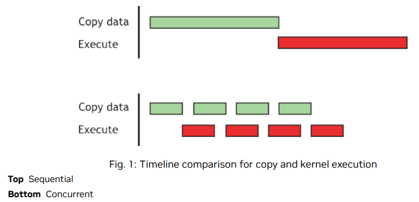

对于这个例子，假设数据传输和内核执行的时间是可比较的。在这种情况下，当执行时间（tE）超过传输时间（tT）时，粗略估计的总时间为分阶段版本的 tE + tT/nStreams，而顺序版本为 tE + tT。如果传输时间超过执行时间，粗略估计的总时间为 tT + tE/nStreams。

#### 13.1.3. Zero Copy (Low Priority)

零拷贝（Zero copy）是在CUDA Toolkit 2.2版本中引入的一项功能。它使得GPU线程能够直接访问主机内存。为此，它需要映射的固定（非可分页）内存。对于集成的GPU（即，CUDA设备属性结构中的integrated字段设置为1的GPU），映射的固定内存总是具有性能优势，因为它避免了不必要的拷贝，集成的GPU和CPU内存在物理上是相同的。对于独立的GPU，映射的固定内存只在特定情况下有优势。由于数据在GPU上不被缓存，映射的固定内存应该只被读取或写入一次，并且读取和写入内存的全局加载和存储操作应该是合并的。零拷贝可以替代流（stream），因为内核发起的数据传输会自动与内核执行重叠，而无需设置和确定最佳数量的流带来的开销

##### Zero-copy host code

```
float *a_h, *a_map;
...
cudaGetDeviceProperties(&prop, 0);
if (!prop.canMapHostMemory)
exit(0);
cudaSetDeviceFlags(cudaDeviceMapHost);
cudaHostAlloc(&a_h, nBytes, cudaHostAllocMapped);
cudaHostGetDevicePointer(&a_map, a_h, 0);
```

在这段代码中，使用cudaGetDeviceProperties()返回的结构体中的canMapHostMemory字段来检查设备是否支持将主机内存映射到设备的地址空间。调用cudaSetDeviceFlags()并传递cudaDeviceMapHost参数可以启用页面锁定内存映射。需要注意的是，cudaSetDeviceFlags()必须在设置设备或进行需要状态的CUDA调用之前调用（基本上是在创建上下文之前）。使用cudaHostAlloc()来分配页面锁定的映射主机内存，并通过函数cudaHostGetDevicePointer()获得映射的设备地址空间的指针。在Zero-copy host code中的kernel()函数中，可以通过指针a_map引用映射的固定主机内存，就像a_map引用设备内存中的位置一样。

映射的固定主机内存允许您将CPU-GPU内存传输与计算重叠，同时避免使用CUDA流。但是，由于对此类内存区域的任何重复访问都会导致重复的CPU-GPU传输，因此请考虑在设备内存中创建第二个区域，以手动缓存先前读取的主机内存数据

#### 13.1.4. 统一虚拟寻址

计算能力2.0及更高版本的设备在64位Linux和Windows上支持一种特殊的寻址模式，称为统一虚拟寻址(UVA)。使用UVA，所有安装的受支持设备的主机内存和设备内存共享一个虚拟地址空间

在UVA之前，应用程序必须跟踪哪些指针引用了设备内存(以及哪个设备)，哪些指针引用了主机内存，作为每个指针的单独元数据位(或作为程序中的硬编码信息)。另一方面，使用UVA，指针所指向的物理内存空间可以通过使用cudaPointerGetAttributes检查指针的值来确定

在UVA下，使用cudaHostAlloc()分配的固定主机内存将具有相同的主机和设备指针，因此没有必要为这种分配调用cudaHostGetDevicePointer()。然而，通过cudaHostRegister()在事后固定的主机内存分配将继续具有与主机指针不同的设备指针，因此在这种情况下cudaHostGetDevicePointer()仍然是必要的

UVA也是实现点对点(P2P)数据传输的必要前提，在支持的配置中，为支持的gpu直接通过PCIe总线或NVLink传输数据，绕过主机内存

有关UVA和P2P的进一步解释和软件要求，请参阅CUDA c++编程指南

### 13.2. 设备内存空间

CUDA设备使用几个内存空间，这些内存空间具有不同的特征，反映了它们在CUDA应用程序中的不同用法。这些内存空间包括全局、本地、共享、纹理和寄存器，如Fig.2所示

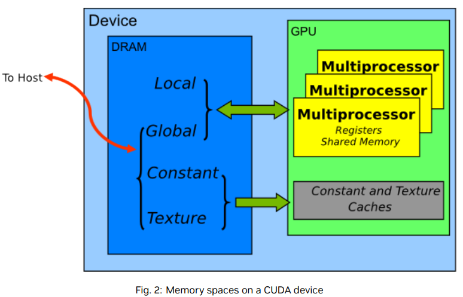

在这些不同的内存空间中，全局内存是最丰富的;有关每个计算能力级别下每个内存空间中可用的内存量，请参阅CUDA c++编程指南的功能和技术规格。全局内存、本地内存和纹理内存的访问延迟最大，其次是常量内存、共享内存和寄存器文件

内存类型的各种主要特征表

|  Memory  | Location on/off chip | Cache | Access |       Scope       |    Life-time    |
| :------: | :------------------: | :---: | :----: | :---------------: | :--------------: |
| Register |          on          |  no  |  R/W  |      thread      |      thread      |
|  Local  |         off         | yes Y |  R/W  |      thread      |      thread      |
|  Shared  |          on          |  no  |  R/W  |       block       |      block      |
|  Global  |         off         |   X   |  R/W  | host + device all | Host allocation |
| Constant |         off         |  yes  |   R   | host + device all | Host allocation |
| Texture |         off         |  yes  |   R   | host + device all | Host allocation |

X: 在计算能力为6.0和7.x的设备上，默认缓存在L1和L2中;在计算能力较低的设备上，默认情况下只在L2中缓存，尽管有些设备也允许通过编译标志选择在L1中缓存

Y: 默认情况下缓存在L1和L2中，计算能力为5.x的设备除外;计算能力设备只在L2中缓存x本地缓存

在纹理访问的情况下，如果纹理引用绑定到全局内存中的线性数组，那么设备代码可以写入底层数组。绑定到CUDA数组的纹理引用可以通过表面写入操作(通过将表面绑定到相同的底层CUDA数组存储)来写入。应该避免在同一内核启动中从纹理读取数据，同时向其底层全局内存数组写入数据，因为纹理缓存是只读的，当相关的全局内存被修改时不会失效

#### 13.2.1. Coalesced Access to Global Memory

在为支持cuda的GPU架构编程时，一个非常重要的性能考虑因素是全局内存访问的合并。全局内存加载和存储的线程被设备合并到尽可能少的事务中。

注意:高优先级:确保尽可能合并全局内存访问。

合并的访问要求取决于设备的计算能力，并在CUDA c++编程指南中有文档说明。

对于计算能力为6.0或更高的设备，需求可以很容易地总结: warp线程的并发访问将合并为许多事务，事务的数量等于为warp的所有线程提供服务所需的 32字节事务 的数量。L1缓存是默认的，但是无论全局负载是否缓存在L1中，数据访问单元都是32字节

对于具有计算能力5.2的某些设备，可以选择性地启用访问全局内存的L1-caching。如果在这些设备上启用L1-caching，则所需的事务数量等于所需的128字节对齐段的数量

在具有GDDR内存的设备上，当启用ECC时，以合并的方式访问内存更加重要。分散访问增加了ECC内存传输开销，特别是在向全局内存写入数据时

下面的简单示例说明了合并概念。这些示例假设计算能力为6.0或更高，并且除非另有说明，否则只能访问4字节字

##### 13.2.1.1. 一个简单的访问模式

合并的第一种也是最简单的情况可以通过任何具有计算能力6.0或更高的cuda设备实现：第k个线程访问32字节对齐数组中的第k个单词。并非所有线程都需要参与

例如，如果一个warp线程访问相邻的4字节字(例如，相邻的float值)，那么四个合并的32字节事务将服务于该内存访问。这种模式如图3所示

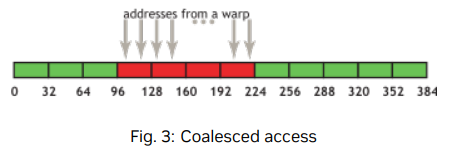

这种访问模式产生4个32字节的事务，用红色矩形表示

如果从四个32字节段中的任何一个中只请求了单词的一个子集(例如，如果几个线程访问了同一个单词，或者如果一些线程没有参与访问)，则无论如何都会获取整个段。此外，如果warp线程的访问在四个段内或跨四个段进行了排列，那么具有6.0或更高计算能力的设备仍然只会执行四个32字节的事务

##### 13.2.1.2. 一个顺序但不对齐的访问模式

如果warp访问内存中的顺序线程是顺序的，但不与32字节段对齐，则将请求5个32字节段，如 Fig.4 所示

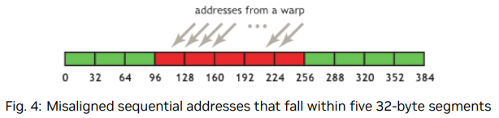

通过CUDA运行时API分配的内存，例如通过cudaMalloc()，保证对齐到至少256字节。因此，选择合理的线程块大小，例如warp大小的倍数(即当前gpu上的32)，有助于通过正确对齐的warp访问内存。(例如，考虑一下如果线程块大小不是warp大小的倍数，那么第二个、第三个和后续线程块访问的内存地址会发生什么情况)

##### 13.2.1.3. 访问不对齐的影响

使用简单的复制内核(例如复制内核a中演示了不对齐访问)来探索不对齐访问的后果很容易，而且信息丰富

###### A copy kernel that illustrates misaligned accesses

```
__global__ void offsetCopy(float *odata, float* idata, int offset)
{
int xid = blockIdx.x * blockDim.x + threadIdx.x + offset;
odata[xid] = idata[xid];
}
```

在说明不对齐访问的复制内核中，数据从输入数组数据复制到输出数组，两者都存在于全局内存中。内核在主机代码中的循环中执行，该循环将参数偏移量从0更改为32。(例如，图4对应于这种错位)在NVIDIA Tesla V100(计算能力7.0)上具有各种偏移的副本的有效带宽如 Fig.5 所示

对于NVIDIA Tesla V100，没有偏移量或偏移量为8个字的整数倍的全局内存访问将导致4个32字节的事务。实现的带宽约为790gb /s。否则，每次warp会加载5个32字节的段，我们期望在没有偏移的情况下实现大约4/5的内存吞吐量

然而，在这个特定的例子中，实现的偏移内存吞吐量大约是9/10，因为相邻的warp重用它们的邻居获取的缓存行。因此，尽管影响仍然很明显，但并不像我们预期的那么大。如果相邻的warp没有对过度获取的缓存线表现出如此高的重用程度，情况就会更糟
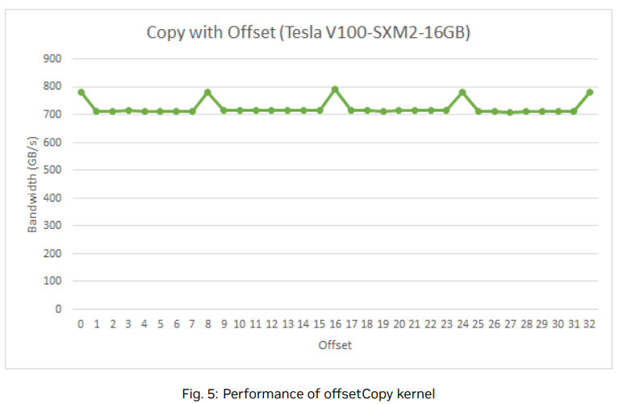

##### 13.2.1.4. 跨行访问

如上所述，在顺序访问不对齐的情况下，缓存有助于减轻性能影响。但是，非单元跨行访问可能有所不同，这是在处理多维数据或矩阵时经常出现的模式。出于这个原因，确保尽可能多的数据在每个缓存行中被实际使用，是这些设备上内存访问性能优化的重要组成部分

为了说明跨行访问对有效带宽的影响，请参阅 **说明非单位跨步数据复制的内核A kernel to illustrate non-unit stride data copy** 中的strideCopy()，它将数据在线程之间从idata复制到odata

```
__global__ void strideCopy(float *odata, float* idata, int stride)
{
int xid = (blockIdx.x*blockDim.x + threadIdx.x)*stride;
odata[xid] = idata[xid];
}
```

Fig.6 说明了这种情况;在这种情况下，warp中的线程以2的步长访问内存中的字。这个动作导致在Tesla V100(计算能力7.0)上每次warp加载8个L2缓存段
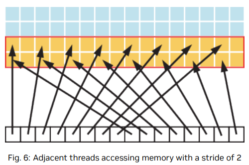

步幅为2会导致50%的负载/存储效率，因为事务中有一半的元素没有被使用，这意味着浪费了带宽。随着跨距的增加，有效带宽会减少，直到为warp中的32个线程加载32个32字节的段，如图7所示
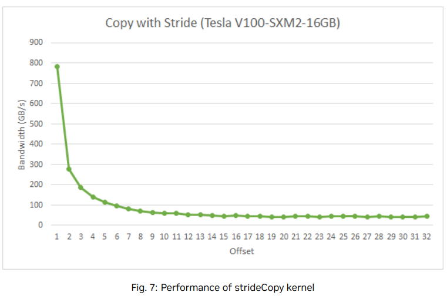

Fig.7:Performance_of_strideCopy_kernel

如 Fig.7 所示，应该尽可能避免非单位步进的全局内存访问。这样做的一种方法是利用共享内存，这将在下一节中讨论

#### 13.2.2. L2高速缓存

从CUDA 11.0开始，计算能力8.0及以上的设备有能力影响L2缓存中数据的持久性。由于L2缓存是片上的，它可能提供更高的带宽和更低的延迟访问全局内存

有关更多细节，请参阅CUDA c++编程指南中的L2访问管理部分 https://docs.nvidia.com/cuda/cuda-c-programming-guide/index.html#device-memory-l2-access-management

##### 13.2.2.1 L2缓存访问窗口

当CUDA内核重复访问全局内存中的数据区域时，这种数据访问可以被认为是持久化的。另一方面，如果数据只被访问一次，这样的数据访问可以被认为是流。L2缓存的一部分可以用于对全局内存中的数据区域进行持久访问。如果持久访问不使用这个预留部分，那么流式或普通数据访问可以使用它

可以在一定范围内调整用于持久访问的L2缓存预留大小:

```
cudaGetDeviceProperties(&prop, device_id);
cudaDeviceSetLimit(cudaLimitPersistingL2CacheSize, prop.persistingL2CacheMaxSize); 
∕*Set aside max possible size of L2 cache for persisting accesses*∕
```

用户数据到L2预留部分的映射可以使用CUDA流或CUDA图内核节点上的访问策略窗口来控制。下面的例子展示了如何在CUDA流上使用访问策略窗口

```
∕∕  Stream level attributes data structure
cudaStreamAttrValue stream_attribute;

∕∕  Global Memory data pointer
stream_attribute.accessPolicyWindow.base_ptr = reinterpret_cast<void*>(ptr);

∕∕  Number of bytes for persisting accesses.
∕∕  (Must be less than cudaDeviceProp::accessPolicyMaxWindowSize)
stream_attribute.accessPolicyWindow.num_bytes = num_bytes;

∕∕  Hint for L2 cache hit ratio for persisting accesses in the num_bytes region
stream_attribute.accessPolicyWindow.hitRatio = 1.0;

∕∕  Type of access property on cache hit
stream_attribute.accessPolicyWindow.hitProp = cudaAccessPropertyPersisting;

∕∕  Type of access property on cache miss.
stream_attribute.accessPolicyWindow.missProp = cudaAccessPropertyStreaming;

∕∕  Set the attributes to a CUDA stream of type cudaStream_t
cudaStreamSetAttribute(stream, cudaStreamAttributeAccessPolicyWindow, &stream_attribute);
```

访问策略窗口需要一个hitRatio和num字节的值。根据num bytes参数的值和二级缓存的大小，可能需要调整hitRatio的值，以避免二级缓存线的抖动

##### 13.2.2.2 调整访问窗口命中率

hitRatio参数可以用来指定接收hitProp属性的访问比例。例如，如果hitRatio值为0.6，则60%的内存访问在全局内存区域[ptr..ptr+num bytes]中具有持久化属性，40%的内存访问具有流属性。为了理解hitRatio和num字节的影响，我们使用滑动窗口微基准测试

这个微基准测试使用了一个1024MB的GPU全局内存区域。首先，我们使用cudaDeviceSetLimit()将30MB的L2缓存空间设置为保持访问。然后，如下图所示，我们指定对内存区域的前freqSize * sizeof(int)字节的访问是保持访问。这些数据将使用L2保留部分。在我们的实验中，我们将这个保持数据区域的大小从10MB变化到60MB，以模拟数据适合或超过30MB可用的L2保留部分的各种情况。需要注意的是，NVIDIA Tesla A100 GPU的总L2缓存容量为40MB。对内存区域剩余数据（即流式数据）的访问被视为正常或流式访问，因此将使用剩余的10MB非保留L2部分（除非保留部分的一部分未使用）。
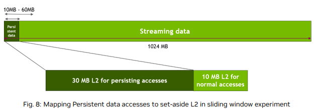
考虑下面的内核代码和访问窗口参数，作为滑动窗口实验的实现

```
__global__ void kernel(
	int *data_persistent,
	int *data_streaming,
	int dataSize,
	int freqSize
) {
    int tid = blockIdx.x * blockDim.x + threadIdx.x;
    // 每个CUDA线程访问持久数据段中的一个元素和流数据段中的一个元素。
    // 因为持久内存区域的大小(freqSize * sizeof(int) bytes)比流内存区域的大小(dataSize * sizeof(int)， bytes)要小得多,
    // 所以持久区域中的数据被访问得更频繁
    data_persistent[tid % freqSize] = 2 * data_persistent[tid % freqSize];
    data_streaming[tid % dataSize] = 2 * data_streaming[tid % dataSize];
}
stream_attribute.accessPolicyWindow.base_ptr = reinterpret_cast<void*>(data_persistent);

∕∕Number of bytes for persisting accesses in range 10-60 MB
stream_attribute.accessPolicyWindow.num_bytes = freqSize * sizeof(int);

/∕Hint for cache hit ratio. Fixed value 1.0 
stream_attribute.accessPolicyWindow.hitRatio = 1.0;
```

下面的图表显示了上述内核的性能。当持久数据区域完全适合L2缓存的30 MB预留部分时，可以观察到性能提高多达50%。然而，一旦这个持久数据区域的大小超过了L2预留缓存部分的大小，由于L2缓存线的抖动，将观察到大约10%的性能下降
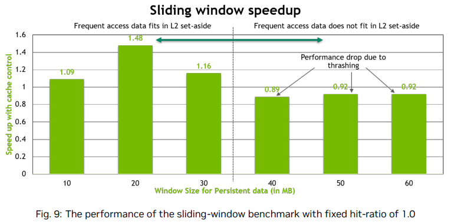

为了优化性能，当持久数据的大小大于预留的L2缓存部分的大小时，我们在访问窗口中调优num bytes和hitRatio参数，如下所示

```
stream_attribute.accessPolicyWindow.base_ptr = reinterpret_cast<void*>(data_persistent);
∕∕20 MB
stream_attribute.accessPolicyWindow.num_bytes = 20*1024*1024;
∕∕Such that up to 20MB of data is resident.
stream_attribute.accessPolicyWindow.hitRatio = (20*1024*1024)∕((float)freqSize*sizeof(int));
```

我们将访问窗口中的num字节固定为20 MB，并调优hitRatio，使总持久数据的随机20 MB驻留在L2预留缓存部分中。这个持久数据的其余部分将使用streaming属性进行访问。这有助于减少缓存抖动。结果如下图所示，无论持久化数据是否适合L2预留，我们都可以看到良好的性能

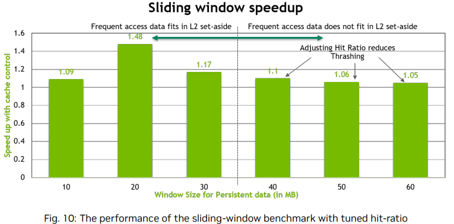

#### 13.2.3. 共享内存

因为它是片上的，所以共享内存比本地和全局内存具有更高的带宽和更低的延迟——前提是线程之间没有 bank 冲突，详见下一节

##### 13.2.3.1. 共享内存和 bank

为了实现并发访问所需的高内存带宽，共享内存被划分为大小相同的可同时访问的内存模块(bank)。因此，跨越n个不同 bank 的任何内存负载或n个地址的存储都可以同时提供服务，从而产生比单个存储库带宽高n倍的有效带宽。

但是，如果一个内存请求的多个地址映射到同一个 bank，则访问是序列化的。硬件将有 bank 冲突的内存请求分割为尽可能多的独立无冲突请求，从而将有效带宽降低到与独立内存请求数量相等的因素。这里的一个例外是，当一个warp中的多个线程地址相同的共享内存位置时，会导致广播。在这种情况下，从请求的共享内存位置到线程，来自不同bank的多个广播合并为单个多播

为了最小化内存库冲突，了解内存地址如何映射到内存库以及如何优化内存请求调度是很重要的

关于计算能力的设备X或更新版本，每个bank每个时钟周期的带宽为 32 bit，并且连续的 32 bit 字被分配给连续的 bank。warp的大小是32个线程，bank的数量也是32个，因此在warp中的任何线程之间都可能发生bank冲突。请参见计算能力5。有关更多细节，请参阅CUDA c++编程指南

##### 13.2.3.2. 矩阵乘法中的共享内存(C=AB)

共享内存支持块中线程之间的协作。当一个块中的多个线程使用来自全局内存的相同数据时，共享内存仅需访问全局内存中的数据一次。共享内存还可以通过从全局内存以合并读写数据，然后在共享内存中重新排序，从而避免非合并内存访问。除了bank冲突之外，对于共享内存中的非顺序或未对齐访问没有任何损失

共享内存的使用是通过一个简单的例子来说明的:对于维数为[M, W]的a、维数为[W, N]的B和维数为[M, N]的C的情况，矩阵乘法C = AB。为了使内核简单，M和N是32的倍数，因为当前设备的warp大小(w)是32

对问题的自然分解是使用大小为[w, w]的线程块。因此，对于[w, w]的线程块，A是列矩阵，B是行矩阵，C是它们的外积;参见图11。启动一个[N/w, M/w]块的网格，其中每个线程块从A的单个块和B的单个块中计算C中不同块的元素

_multiplied_by_block-row_matrix_(B)_with_resulting_product_matrix_(C)..png)

为此，simplemulmultiply内核(**未优化的矩阵乘法Unoptimized matrix multiplication**)计算矩阵C的一个块的输出元素

###### 未优化的矩阵乘法Unoptimized matrix multiplication

```
__global__ void simpleMultiply(
    float *a,
    float* b,
    float *c,
    int N
) {
    int row = blockIdx.y * blockDim.y + threadIdx.y;
    int col = blockIdx.x * blockDim.x + threadIdx.x;
    float sum = 0.0f;
    for (int i = 0; i < TILE_DIM; i++) {
        sum += a[row*TILE_DIM+i] * b[i*N+col];
    }
    c[row*N+col] = sum;
}
```

在**未优化的矩阵乘法（Unoptimized matrix multiplication**中，a、b和c分别是指向矩阵A、B和C的全局内存的指针；blockDim.x、blockDim.y和TILE_DIM都等于w。线程块中的每个线程计算C矩阵中一个瓦片（tile）中的一个元素。row和col表示特定线程计算的C矩阵中的元素的行和列。对于循环中的i遍历，将A矩阵的一行与B矩阵的一列相乘，并将结果写入C矩阵。

在NVIDIA Tesla V100上，该内核的有效带宽为119.9 GB/s。为了分析性能，需要考虑warp在for循环中访问全局内存的方式。每个线程束（warp）计算一个C矩阵瓦片的一行，这依赖于A矩阵的一行和整个B矩阵瓦片，如Fig.12所示。

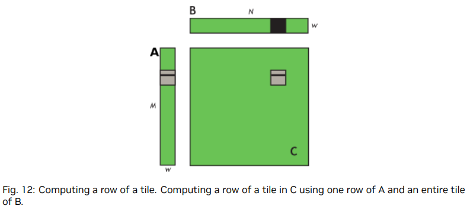

对于For循环的每次迭代i, warp中的线程读取B块的一行，这是由于顺序和合并访问，对所有计算能力都是这样。

然而，在每次迭代i中，线程束中的所有线程从全局内存中读取矩阵A的相同值，因为在线程束内部，索引row*TILE_DIM+i是固定的。尽管这样的访问在计算能力2.0或更高的设备上只需要1个事务，但在事务中浪费了带宽，因为在32byte的缓存段中，只使用了4byte。我们可以在循环的后续迭代中重复使用这个缓存行，并最终利用所有8个字；然而，当许多线程束同时在同一个多处理器上执行时（通常是这种情况），在迭代i和i+1之间，缓存行很容易被从缓存中驱逐出去。

任何计算能力的设备上的性能都可以通过将a读入共享内存来提高，如 **使用共享内存来提高矩阵乘法中的全局内存负载效率Using shared memory to improve the global memory load efficiency in matrix multiplication** 所示

###### 使用共享内存来提高矩阵乘法中的全局内存负载效率Using shared memory to improve the global memory load efficiency in matrix multiplication

```
__global__ void coalescedMultiply(
    float *a,
    float* b,
    float *c,
    int N
) {
    __shared__ float aTile[TILE_DIM][TILE_DIM];
    int row = blockIdx.y * blockDim.y + threadIdx.y;
    int col = blockIdx.x * blockDim.x + threadIdx.x;
    float sum = 0.0f;
    aTile[threadIdx.y][threadIdx.x] = a[row*TILE_DIM+threadIdx.x];
    __syncwarp();
    for (int i = 0; i < TILE_DIM; i++) {
        sum += aTile[threadIdx.y][i]* b[i*N+col];
    }
    c[row*N+col] = sum;
}
```

在**使用共享内存来提高矩阵乘法中的全局内存负载效率Using shared memory to improve the global memory load efficiency in matrix multiplication**的示例中，每个A矩阵瓦片中的元素只从全局内存中读取一次，并以完全合并的方式（没有带宽浪费）存储到共享内存中。在for循环的每次迭代中，共享内存中的一个值被广播给线程束中的所有线程。不需要使用__syncthreads()同步屏障调用，只需在将A矩阵瓦片读取到共享内存后使用__syncwarp()即可，因为只有写入数据到共享内存的线程束内的线程才会读取这些数据。在NVIDIA Tesla V100上，该内核的有效带宽为144.4 GB/s。这说明了在硬件L1缓存的驱逐策略与应用程序需求不匹配或L1缓存不用于从全局内存中读取时，如何将共享内存用作用户管理的缓存。

可以进一步改进如何使用共享内存来提高矩阵乘法处理矩阵B的全局内存负载效率。在计算矩阵C的每一行时，将读取整个B的块。可以通过将B块读入一次共享内存来消除对它的重复读取(通过将额外的数据读入共享内存来改进)

###### Improvement by reading additional data into shared memory

```
__global__ void sharedABMultiply(
    float *a,
    float* b,
    float *c,
    int N
){
    __shared__ float aTile[TILE_DIM][TILE_DIM],
    bTile[TILE_DIM][TILE_DIM];
    int row = blockIdx.y * blockDim.y + threadIdx.y;
    int col = blockIdx.x * blockDim.x + threadIdx.x;
    float sum = 0.0f;
    aTile[threadIdx.y][threadIdx.x] = a[row*TILE_DIM+threadIdx.x];
    bTile[threadIdx.y][threadIdx.x] = b[threadIdx.y*N+col];
    __syncthreads();
    for (int i = 0; i < TILE_DIM; i++) {
        sum += aTile[threadIdx.y][i]* bTile[i][threadIdx.x];
    }
    c[row*N+col] = sum;
}
```

请注意，在通过向共享内存中读取额外数据的改进中，在读取B块之后需要调用syncthreads()，因为warp从共享内存中读取数据，这些数据是由不同的warp写入共享内存的。在NVIDIA Tesla V100上，此例程的有效带宽为195.5 GB/s。请注意，性能的提高不是由于两种情况下合并的改进，而是由于避免了来自全局内存的冗余传输，下表总结了各种优化的结果。

| Optimization                                                    | NVIDIA Tesla V100 |
| --------------------------------------------------------------- | ----------------- |
| No optimization                                                 | 119.9 GB/s        |
| Coalesced using shared memory to store a tile of A              | 144.4 GB/s        |
| Using shared memory to eliminate redundant reads of a tile of B | 195.5 GB/s        |

**中等优先级:使用共享内存以避免全局内存的冗余传输**

##### 13.2.3.3. 矩阵乘法中的共享内存(C=AAT)

可以使用前面的矩阵乘法的一个变体来说明如何处理对全局内存的跨行访问以及共享内存bank冲突。这种变体只是用A的转置代替B，也就是$C = AA^T$。

```
__global__ void simpleMultiply(float *a, float *c, int M)
{
    int row = blockIdx.y * blockDim.y + threadIdx.y;
    int col = blockIdx.x * blockDim.x + threadIdx.x;
    float sum = 0.0f;
    for (int i = 0; i < TILE_DIM; i++) {
        sum += a[row*TILE_DIM+i] * a[col*TILE_DIM+i];
    }
    c[row*M+col] = sum;
}
```

在处理对全局内存的跨越式访问（strided accesses）的未优化示例中，通过计算矩阵A的第row行和第col行的点积来获得C矩阵的第row行、第col列元素。在NVIDIA Tesla V100上，该内核的有效带宽为12.8 GB/s。与C = AB内核相比，这些结果显著较低。差异在于半个线程束中的线程在第二个项中访问A矩阵的元素a[colTILE_DIM+i]的方式。对于一个线程束，col表示A的转置的顺序列，因此colTILE_DIM表示具有步长w的全局内存跨越式访问，导致大量的带宽浪费。
避免跨行访问的方法是像以前一样使用共享内存，除了在这种情况下，warp将行a读取到共享内存块的列中，如使用全局内存的合并读取对跨行访问的优化处理所示
**An optimized handling of strided accesses using coalesced reads from global memory**

```
__global__ void coalescedMultiply(float *a, float *c, int M)
{
    __shared__ float aTile[TILE_DIM][TILE_DIM], transposedTile[TILE_DIM][TILE_DIM];
    int row = blockIdx.y * blockDim.y + threadIdx.y;
    int col = blockIdx.x * blockDim.x + threadIdx.x;
    float sum = 0.0f;
    aTile[threadIdx.y][threadIdx.x] = a[row*TILE_DIM+threadIdx.x];
    transposedTile[threadIdx.x][threadIdx.y] =
    a[(blockIdx.x*blockDim.x + threadIdx.y)*TILE_DIM +
    threadIdx.x];
    __syncthreads();
    for (int i = 0; i < TILE_DIM; i++) {
        sum += aTile[threadIdx.y][i]* transposedTile[i][threadIdx.x];
    }
    c[row*M+col] = sum;
}
```

使用从全局内存中合并读取的方法优化跨行访问 示例使用共享 transposedTile来避免点积中第二项的非合并访问，并使用前面示例中的共享tile技术来避免第一项的非合并访问。在NVIDIA Tesla V100上，该内核的有效带宽为140.2 GB/s。这些结果比C = AB的最终内核得到的结果要低。造成差异的原因是共享内存bank冲突

在for循环中对transposedTile中元素的读取是无冲突的，因为每个半个线程束跨越矩阵的行进行读取，使得各个bank之间的步长为单位步长。然而，当将矩阵从全局内存复制到共享内存时，会发生bank冲突。为了使从全局内存加载的数据能够合并，数据需要按顺序从全局内存中读取。然而，这要求以列的方式写入共享内存，并且由于在共享内存中使用了wxw大小的瓦片，这导致了w个bank之间的步长 - 每个线程束中的线程都会访问同一个bank（回顾一下，w被选择为32）。这种多路bank冲突非常昂贵。简单的解决方法是给共享内存数组填充一个额外的列，就像以下代码行中一样。

```
__shared__ float transposedTile[TILE_DIM][TILE_DIM+1];
```

这种填充完全消除了冲突，因为现在线程之间的步幅是w+1个银行(即当前设备的33个)，由于用于计算银行索引的模算法，这相当于一个单位步幅。在此更改之后，NVIDIA Tesla V100上的有效带宽为199.4 GB/s，这与最后一个C = AB内核的结果相当

| Optimization                                 | NVIDIA Tesla V100 |
| -------------------------------------------- | ----------------- |
| No optimization                              | 12.8 GB/s         |
| Using shared memory to coalesce global reads | 140.2 GB/s        |
| Removing bank conflicts                      | 199.4 GB/s        |

从这些表中可以看出，明智地使用共享内存可以显著提高性能

本节中的示例展示了使用共享内存的三个原因：

* 使全局内存访问合并，特别是为了避免大步长（对于一般矩阵而言，步长通常大于32）
* 消除（或减少）来自全局内存的冗余加载
* 避免带宽浪费

##### 13.2.3.4. 全局内存异步复制到共享内存

CUDA 11.0引入了一个异步复制特性，可以在设备代码中使用，以显式地管理数据从全局内存到共享内存的异步复制。此功能使CUDA内核可以将数据从全局内存复制到共享内存与计算重叠。它还避免了传统上在全局内存读取和共享内存写入之间存在的中间寄存器文件访问。

https://docs.nvidia.com/cuda/cuda-c-programming-guide/index.html#asynchronous-data-copies

为了理解数据从全局内存到共享内存的同步复制和异步复制之间的性能差异，请考虑以下微基准CUDA内核来演示同步和异步方法。NVIDIA A100 GPU演示

```
template <typename T>
__global__ void pipeline_kernel_sync(T *global, uint64_t *clock, size_t copy_count) {
    extern __shared__ char s[];
    T *shared = reinterpret_cast<T *>(s);
    uint64_t clock_start = clock64();
    for (size_t i = 0; i < copy_count; ++i) {
        shared[blockDim.x * i + threadIdx.x] = global[blockDim.x * i + threadIdx.x];
    }
    uint64_t clock_end = clock64();
    atomicAdd(
        reinterpret_cast<unsigned long long *>(clock),
        clock_end - clock_start
    );
}
template <typename T>
__global__ void pipeline_kernel_async(T *global, uint64_t *clock, size_t copy_count) {
    extern __shared__ char s[];
    T *shared = reinterpret_cast<T *>(s);
    uint64_t clock_start = clock64();
    ∕∕pipeline pipe;
    for (size_t i = 0; i < copy_count; ++i) {
        __pipeline_memcpy_async(
            &shared[blockDim.x * i + threadIdx.x],
            &global[blockDim.x * i + threadIdx.x],
            sizeof(T)
        );
    }
    __pipeline_commit();
    __pipeline_wait_prior(0);
    uint64_t clock_end = clock64();
    atomicAdd(
        reinterpret_cast<unsigned long long *>(clock),
        clock_end - clock_start
    );
}
```

同步版本的内核将一个元素从全局内存加载到一个中间寄存器，然后将中间寄存器的值存储到共享内存中。在异步版本的内核中，从全局内存加载和直接存储到共享内存的指令会在调用__pipeline_memcpy_async()函数时立即发出。__pipeline_wait_prior(0)将等待直到管道对象中的所有指令都执行完毕。使用异步复制不使用任何中间寄存器。不使用中间寄存器可以帮助减少寄存器压力，并增加内核的占用率。使用异步复制指令从全局内存复制到共享内存的数据可以缓存在L1缓存中，或者可以选择绕过L1缓存。

▶ 在同步复制中，当copy_count参数对于所有三种元素大小都是4的倍数时，可以获得最佳性能。编译器可以优化4个加载和存储指令的组合。从锯齿状曲线中可以看出这一点。
▶ 在几乎所有情况下，异步复制可以实现更好的性能。
▶ 异步复制不需要copy_count参数是4的倍数，可以通过编译器优化来最大化性能。
▶ 总体而言，使用异步复制和大小为8或16字节的元素可以实现最佳性能。

#### 13.2.4. 本地内存

本地内存之所以被称为本地内存，是因为其作用域局限于线程本身，而不是因为其物理位置。实际上，本地内存位于芯片外部。因此，访问本地内存的开销与访问全局内存一样昂贵。换句话说，名称中的本地并不意味着更快的访问。

本地内存仅用于存储自动变量。当nvcc编译器确定寄存器空间不足以容纳变量时，会将其存储在本地内存中。可能被放置在本地内存中的自动变量包括占用太多寄存器空间的大型结构体或数组，以及编译器确定可能需要动态索引的数组。

检查PTX汇编代码（通过使用-ptx或-keep命令行选项编译nvcc）可以了解变量是否在第一次编译阶段被放置在本地内存中。如果是的话，将使用.local助记符声明变量，并使用ld.local和st.local助记符访问变量。如果没有，后续的编译阶段可能会根据目标架构发现变量占用过多寄存器空间而做出不同的决策。无法检查特定变量的情况，但是当编译器使用--ptxas-options=-v选项运行时，会报告每个内核的总本地内存使用量（lmem）。

#### 13.2.5. 纹理内存

只有在缓存未命中时，只读纹理内存空间的读取才会引发一次设备内存读取操作；否则，它只会从纹理缓存中读取一次。纹理缓存针对二维空间局部性进行了优化，因此读取接近的纹理地址的线程束将获得最佳性能。纹理内存还设计用于具有恒定延迟的流式获取操作；也就是说，缓存命中可以降低DRAM带宽需求，但无法减少获取延迟。在某些寻址情况下，通过纹理获取设备内存可以成为读取全局内存或常量内存中设备内存的有利替代方式。

##### 13.2.5.1. 附加纹理功能

如果使用tex1D()、tex2D()或tex3D()而不是tex1Dfetch()获取纹理，则硬件提供的其他功能可能对某些应用程序(如图像处理)有用.

在内核调用中，纹理缓存不与全局内存写入保持一致，因此从通过同一内核调用中的全局存储写入的地址获取纹理会返回未定义的数据。也就是说，一个线程可以通过纹理安全地读取一个内存位置。但是如果这个位置之前已经被同一个线程或同一个内核调用中的另一个线程更新过，则不能

###### 滤波

快速、低精度的纹理像素插值，只有当纹理引用返回浮点数据时才有效

###### 归一化纹理坐标

分辨率无关编码

###### 寻址方式

边界情况的自动处理，指纹理坐标在有效寻址范围之外时如何解析。有两种选择:夹紧和包裹。如果x是坐标，N是一维纹理的元素数，则使用clamp，如果x < 0，则x被替换为0，如果1 <x，则被替换为1-1/N。使用wrap, x被frac(x)替换，其中frac(x) = x - floor(x)。Floor返回小于或等于x的最大整数。因此，在N = 1的箝位模式下，x的1.3被箝位到1.0;而在换行模式下，它被转换为0.3，只有当纹理引用返回浮点数据时才有效

#### 13.2.6. 常量内存

设备上总共有64 KB的常量内存。常量内存空间是有缓存的。因此，只有在缓存未命中时，从常量内存读取数据才会引发一次设备内存读取操作；否则，它只会从常量缓存中读取一次。线程束内的不同地址访问是串行化的，因此成本与线程束内所有线程读取的唯一地址数量成线性关系。因此，当同一个线程束中的线程只访问少数不同的位置时，常量缓存的性能最佳。如果线程束中的所有线程访问相同位置，那么常量内存的访问速度可以和寄存器访问一样快。

#### 13.2.7. 寄存器

通常情况下，访问寄存器不会消耗额外的时钟周期。但是，由于寄存器读写依赖和寄存器内存bank冲突，可能会发生延迟。

编译器和硬件线程调度器将尽可能地优化调度指令，以避免寄存器内存bank冲突。应用程序无法直接控制这些bank冲突。特别地，没有与寄存器相关的理由将数据打包成向量数据类型，如float4或int4类型。

##### 13.2.7.1. 寄存器压力

当给定任务没有足够的寄存器可用时，就会出现寄存器压力。即使每个多处理器包含数千个32位寄存器(参见CUDA c++编程指南的功能和技术规范)，这些寄存器也在并发线程之间进行分区。为了防止编译器分配过多的寄存器，使用-maxrregcount=N编译器命令行选项(参见nvcc)或启动边界内核定义限定符(参见CUDA c++编程指南的执行配置)来控制每个线程分配的最大寄存器数

### 13.3. Allocation

通过cudaMalloc()和cudaFree()分配和释放设备内存是昂贵的操作。建议使用cudaMallocAsync()和cudaFreeAsync()，它们是流顺序池分配器来管理设备内存。

### 13.4. NUMA最佳做法

一些最新的Linux发行版默认启用自动NUMA平衡(或AutoNUMA)。在某些情况下，自动NUMA平衡执行的操作可能会降低在NVIDIA gpu上运行的应用程序的性能。为了获得最佳性能，用户应该手动调优其应用程序的NUMA特征

优化的NUMA调优策略将取决于每个应用程序和节点的特性和所需的硬件亲和性，但一般建议在计算NVIDIA GPU上的应用程序时选择禁用自动NUMA平衡的策略。例如，在IBM Newell POWER9节点上（其中CPU对应于NUMA节点0和8），可以使用 numactl --membind=0,8 将内存分配绑定到CPU。

## CP14. 执行配置优化

优秀性能的关键之一是尽可能使设备上的多处理器保持忙碌状态。在多处理器之间平衡工作不佳的设备将导致性能下降。因此，重要的是设计应用程序以在最大程度上利用硬件，并限制影响工作自由分配的做法。在这方面的一个关键概念是"occupancy"（占用率），将在下面的章节中进行解释。

在某些情况下，通过设计应用程序，使得多个独立的内核可以同时执行，也可以提高硬件利用率。多个内核同时执行称为并发内核执行。并发内核执行将在下面进行介绍。

另一个重要的概念是管理为特定任务分配的系统资源。如何管理这些资源的利用将在本章的最后几节中进行讨论。

### 14.1. 占用率

在CUDA中，线程指令是顺序执行的。因此，在一个线程束暂停或阻塞时，执行其他线程束是隐藏延迟并保持硬件忙碌的唯一方法。因此在确定硬件的有效利用程度方面，一个多处理器上的活跃线程束数量有关的某些指标非常重要。这个指标就是occupancy（占用率）。

占用率是每个多处理器上活跃线程束数与最大可能活跃线程束数的比率。（要确定后者的数量，请参考deviceQuery CUDA示例或参考CUDA C++编程指南中的"Compute Capabilities"一节。）

更高的占用率并不总是意味着更高的性能，超过一定点的额外占用率并不能提高性能。然而，低占用率总是影响隐藏内存延迟的能力，导致性能下降。

CUDA内核所需的每个线程的资源可能会以不希望的方式限制最大的线程块大小。为了确保对未来的硬件和工具包保持向前兼容，并确保至少可以在一个SM上运行一个线程块，开发者应该include一个参数__launch_bounds__(maxThreadsPerBlock)，该参数指定了内核将要启动的最大块大小。如果不这样做，可能会导致"too many resources requested for launch"（启动请求的资源过多）错误。在某些情况下，提供两个参数的__launch_bounds__(maxThreadsPerBlock, minBlocksPerMultiprocessor)版本可以提高性能。minBlocksPerMultiprocessor的正确值应该通过详细的每个内核分析来确定。

#### 14.1.1. 计算占用

决定占用率的几个因素之一是寄存器的可用性。寄存器存储使线程能够将本地变量保存在附近，以便进行低延迟访问。然而，寄存器集(称为寄存器文件)是有限的，驻留在一个多处理器上的所有线程必须共享它。寄存器一次全部分配给整个块。因此，如果每个线程块使用许多寄存器，那么可以驻留在多处理器上的线程块的数量就会减少，从而降低了多处理器的占用。每个线程的最大寄存器数可以手动设置。

计算占用率时，每个线程使用的寄存器数量是其中一个关键因素。例如，在计算能力为7.0的设备上，每个多处理器有65,536个32位寄存器，最多可以有2048个同时驻留的线程（64个线程束x每个线程束32个线程）。这意味着在这样的设备上，要使多处理器的占用率达到100%，每个线程最多可以使用32个寄存器。然而，这种确定寄存器数如何影响占用率的方法没有考虑寄存器分配的粒度。例如，在计算能力为7.0的设备上，一个使用每个线程37个寄存器的128线程块的内核将具有75%的占用率，每个多处理器有12个活动的128线程块；而一个使用每个线程37个寄存器的320线程块的内核将具有63%的占用率，因为每个多处理器上只有四个320线程块。此外，寄存器分配会向最近的256个寄存器每个线程束进行舍入。

可用的寄存器数量，每个多处理器上的最大同时驻留线程数以及寄存器分配的粒度会随着不同的计算能力而变化。由于寄存器分配中的这些微妙差别，以及多处理器的共享内存也被分割为驻留线程块，寄存器使用和占用率之间的确切关系可能很难确定。nvcc的--ptxas options=v选项详细说明了每个内核每个线程使用的寄存器数。在CUDA C++编程指南的Hardware Multithreading一节中可以找到适用于不同计算能力设备的寄存器分配公式，而在CUDA C++编程指南的Features and Technical Specifications一节中可以找到这些设备上可用的总寄存器数量。此外，NVIDIA提供了一个名为CUDA_Occupancy_Calculator.xls的Excel电子表格，可以帮助开发人员找到最佳平衡并更轻松地测试不同的可能场景。该电子表格位于CUDA Toolkit安装的tools子目录中。

除了计算器电子表格外，可以使用NVIDIA Nsight Compute Profiler来确定占用率。占用率的详细信息显示在Occupancy部分。

应用程序还可以使用CUDA Runtime的Occupancy API，例如cudaOccupancyMaxActiveBlocksPerMultiprocessor，根据运行时参数动态选择启动配置。

### 14.2. 隐藏寄存器依赖

注意:中等优先级:为了隐藏由寄存器依赖引起的延迟，请为每个多处理器维护足够数量的活动线程(即足够的占用)

寄存器依赖出现在一个指令使用了由之前的指令写入的寄存器中存储的结果时。在计算能力为7.0的设备上，大多数算术指令的延迟通常为4个周期。因此，线程必须等待大约4个周期才能使用算术结果。然而，这种延迟可以通过其他线程束中的线程的执行完全隐藏。详细信息请参见Registers（寄存器）部分。

### 14.3. 线程和块启发式

注意:中等优先级:每个块的线程数应该是32个线程的倍数，因为这样可以提供最佳的计算效率并促进合并

网格内块的维度和大小以及块内线程的维度和大小都是重要因素。这些参数的多维特性使得将多维问题映射到CUDA更加容易，而且不影响性能。因此，本节讨论大小，而不涉及维度。

隐藏延迟和占用率取决于每个多处理器的活跃线程束数，这是隐含由执行参数和资源（寄存器和共享内存）限制确定的。选择执行参数是在延迟隐藏（占用率）和资源利用之间取得平衡的问题。

选择执行配置参数应该同时进行；然而，每个参数都有一定的启发式规则。选择第一个执行配置参数-网格中的块数，或者网格大小-主要考虑的是保持整个GPU繁忙。网格中的块数应该大于多处理器的数量，以便所有多处理器至少有一个块可以执行。此外，每个多处理器应该有多个活跃块，这样没有在等待__syncthreads()的块就可以让硬件保持繁忙。这些建议取决于资源的可用性；因此，应该在第二个执行参数-块内线程数或块大小-以及共享内存使用情况的背景下确定。为了适应未来的设备，每个内核启动的块数应该在数千个以上。

在选择块大小时，重要的是要记住多个并发块可以驻留在一个多处理器上，因此占用率不仅由块大小决定。特别地，较大的块大小并不意味着更高的占用率。

正如在占用率一节中提到的，更高的占用率并不总是意味着更好的性能。例如，将占用率从66%提高到100%通常不会带来类似的性能增加。较低占用率的内核每个线程可用的寄存器比较多，而较高占用率的内核可能导致较多寄存器溢出到本地内存；特别是在暴露出大量指令级并行性（ILP）的情况下，有时可以通过低占用率来完全覆盖延迟。

在选择块大小时涉及许多因素，不可避免地需要一些实验。然而，应遵循一些经验法则：

* 每个块的线程数应该是线程束大小的倍数，以避免在线程束中浪费计算资源，并促进合并操作。
* 应该使用至少64个线程的块，但只有在每个多处理器上有多个并发块时。
* 在每个块中选择128到256个线程是进行不同块大小实验的良好起始范围。
* 如果延迟影响性能，应该使用多个较小的线程块而不是一个较大的线程块来驻留在每个多处理器上。这对于经常调用__syncthreads()的内核尤其有益。

请注意，当线程块分配的寄存器多于多处理器上可用的寄存器时，内核启动就会失败，就像请求太多共享内存或太多线程时一样

### 14.4. 共享内存的影响

共享内存在许多情况下都是有帮助的，例如有助于合并或消除对全局内存的冗余访问。然而，它也可能限制执行率。在许多情况下，内核所需的共享内存量与所选择的块大小有关，但是线程与共享内存元素之间的映射不必是一对一的。例如，可能希望在内核中使用一个64x64元素的共享内存数组，但由于每个块的最大线程数是1024，因此无法以64x64线程每块的方式启动内核。在这种情况下，可以使用32x32或64x16线程的内核，其中每个线程处理共享内存数组的四个元素。即使线程每块的限制不是问题，使用单个线程来处理多个共享内存数组元素的方法也可能是有益的。这是因为线程可以对每个元素执行一些共同操作，将成本分摊到线程处理的共享内存元素数量上。
通过实验动态分配的共享内存量，可以确定性能对执行率的敏感性。通过增加此参数（而无需修改内核），可以有效降低内核的执行率，并测量其对性能的影响。

### 14.5. 并发内核执行

如在**异步和重叠的数据传输与计算Asynchronous and Overlapping Transfers with Computation**中所述，CUDA流可以用于将内核执行与数据传输重叠。在支持并发内核执行的设备上，流也可以用于同时执行多个内核，以更充分地利用设备的多处理器。设备是否具有这种功能由cudaDeviceProp结构的concurrentKernels字段表示（或在deviceQuery CUDA示例的输出中列出）。并发执行需要使用非默认流（即非stream 0的流），因为使用默认流的内核调用只会在设备上的所有前面的调用（在任何流中）都完成后开始执行，并且在它们完成之前不会执行设备上的任何操作（在任何流中）。

下面的示例演示了基本技巧。由于kernel1和kernel2在不同的非默认流中执行，因此支持并发执行的设备可以同时执行这两个内核。

```
cudaStreamCreate(&stream1);
cudaStreamCreate(&stream2);
kernel1<<<grid, block, 0, stream1>>>(data_1);
kernel2<<<grid, block, 0, stream2>>>(data_2);
```

### 14.6. 多个上下文

CUDA的工作发生在特定GPU的进程空间中，这个进程空间称为上下文（context）。上下文封装了该GPU上的内核启动和内存分配，以及支持的构造，比如页表。在CUDA Driver API中，上下文是显式管理的，但在CUDA Runtime API中，上下文是完全隐式管理的，它会自动创建和管理上下文。

在CUDA Driver API中，一个CUDA应用程序进程可以为给定的GPU创建多个上下文。如果多个CUDA应用程序进程同时访问同一个GPU，这几乎总是意味着有多个上下文，因为上下文与特定的主机进程相关联，除非使用了多进程服务（MultiProcess Service）。

虽然可以在给定的GPU上并发地分配多个上下文（及其相关的全局内存分配等资源），但在同一时刻这些上下文中只有一个可以在执行；共享同一GPU的上下文是按时间片切换的。创建额外的上下文会产生上下文数据的内存开销和上下文切换的时间开销。此外，当来自多个上下文的工作可以同时执行时，但上下文切换的需求会降低利用率(参见 **并发内核执行 Concurrent Kernel Execution**)

因此，最好避免在同一个CUDA应用程序中为一个GPU创建多个上下文。为了帮助实现这一点，CUDA Driver API提供了访问和管理每个GPU上的一个特殊上下文（称为主要上下文）的方法。这些上下文在CUDA Runtime中没有当前上下文的情况下被隐式使用。

```
∕∕ When initializing the program∕library
CUcontext ctx;
cuDevicePrimaryCtxRetain(&ctx, dev);
∕∕ When the program∕library launches work
cuCtxPushCurrent(ctx);
kernel<<<...>>>(...);
cuCtxPopCurrent(&ctx);
∕∕ When the program∕library is finished with the context
cuDevicePrimaryCtxRelease(dev);
```

Note: NVIDIA-SMI是用来配置GPU的工具，可以用于将GPU设置为独占进程模式，这会将每个GPU的上下文数量限制为一个。这个上下文可以在创建它的进程中作为当前上下文，而且可以在许多线程中共享。如果在设备上已经存在一个使用CUDA Driver API创建的非主要上下文，那么cuDevicePrimaryCtxRetain将失败。

## CP15. 指令优化

了解指令是如何执行的，通常可以进行有用的底层优化，特别是在频繁运行的代码中(程序中的所谓热点)。最佳实践建议在完成所有高级优化之后执行此优化

### 15.1. 算术指令

单精度浮点数提供了最好的性能，它们的使用是高度鼓励的。单个算术运算的吞吐量在CUDA c++编程指南中有详细说明

#### 15.1.1. 除法模运算

注意:低优先级:使用移位操作来避免昂贵的除法和模计算

整数除法和模数运算特别昂贵，应该尽可能避免或用位运算代替:

如果n是2的幂，$(i/n = i >> log_2n)   $， (i%n)等于(i&(n 1))。

如果n是字面量，编译器将执行这些转换。欲了解更多信息，请参阅 CUDA C++ Programming Guide

#### 15.1.2. 有符号与无符号循环计数器

注意:低中优先级:使用有符号整数而不是无符号整数作为循环计数器

在C语言标准中，无符号整数溢出语义定义良好，而有符号整数溢出导致未定义的结果。因此，与使用无符号算术相比，编译器可以更积极地优化有符号算术。对于循环计数器来说，这一点尤其值得注意:因为循环计数器的值通常都是正的，所以将计数器声明为unsigned可能很诱人。但是，为了稍微提高性能，应该将它们声明为signed。例如，考虑下面的代码

```
for (i = 0; i < n; i++) {
    out[i] = in[offset + stride*i];
}
```

这里，子表达式stride*i可能溢出一个32位整数，因此，如果将i声明为无符号，则溢出语义会阻止编译器使用一些本来可以应用的优化，例如强度降低。如果将i声明为有符号的，其中溢出语义是未定义的，则编译器有更多的余地来使用这些优化

#### 15.1.3. 根号倒数

对于单精度，应该始终显式地调用倒数平方根为rsqrtf()，对于双精度则为rsqrt()。编译器只会在不违反IEEE-754语义的情况下将1.0f /sqrtf(x)优化为rsqrtf()

#### 15.1.4. 其他算术指令

注意:低优先级:避免自动将双精度转换为浮点数
编译器在某些情况下必须插入转换指令，引入额外的执行周期。以下情况属于这种情况：

* 操作char或short类型的函数，其操作数通常需要转换为int类型
* 使用双精度浮点常数（没有任何类型后缀定义）作为输入进行单精度浮点计算

后一种情况可以通过使用带有f后缀的单精度浮点常数来避免，比如3.141592653589793f、1.0f、0.5f。

对于单精度代码，强烈建议使用float类型和单精度数学函数。

还应该注意，CUDA数学库的互补误差函数erfcf()特别快而且完全单精度正确。

#### 15.1.5. 小分数参数的求幂

对于某些分数指数，与使用pow()相比，通过使用平方根、立方根及其逆，幂运算可以显著加快。对于那些指数不能精确地表示为浮点数(如1/3)的幂运算，这也可以提供更准确的结果，因为使用pow()会放大初始表示误差

下表中的公式适用于x >= 0, x != -0，即signbit(x) == 0

| Computation | Formula             |
| ----------- | ------------------- |
| $x^{1/9}$ | r = rcbrt(rcbrt(x)) |
| $x^{1/6}$ | r = rcbrt(rsqrt(x)) |
| ...         | ...                 |

#### 15.1.6. 数学库

注意:中等优先级:当速度胜过精度时，使用快速数学库

运行时支持两种类型的数学运算。它们可以通过它们的名称来区分：一些函数的名称前面有下划线，而另一些函数没有（例如__functionName()和functionName()）。按照__functionName()命名约定的函数直接映射到硬件级别。它们运行更快，但提供稍低的精度（例如__sinf(x)和__expf(x)）。按照functionName()命名约定的函数运行较慢，但具有更高的精度（例如sinf(x)和expf(x)）。__sinf(x)、__cosf(x)和__expf(x)的吞吐量远大于sinf(x)、cosf(x)和expf(x)。如果需要缩小参数x的幅值，后者的速度会更慢（慢大约一个数量级）。此外，在这种情况下，参数缩减代码会使用本地内存，这可能会影响性能，因为本地内存具有较高的延迟。更多详细信息可在CUDA C++编程指南中找到。

另外，当计算相同参数的正弦和余弦时，应使用sincos系列指令来优化性能：

* 对于单精度快速数学（见下一段）使用__sincosf()
* 对于普通单精度使用sincosf()
* 对于双精度使用sincos()

nvcc编译器选项 -use_fast_math 将每个functionName()调用强制转换为相应的__functionName()调用。它还禁用单精度denormal支持，并降低单精度除法的精度。这是一种激进的优化，可能会降低数值精度并改变特殊情况处理。更可靠的方法是只在性能增益可以证明并且可以容忍更改行为的情况下有选择地引入快速的内部函数调用。请注意，此开关仅对单精度浮点数有效。

注意:中等优先级:在可能的情况下，更喜欢更快、更专业的数学函数，而不是更慢、更通用的数学函数

对于小的整数幂（例如x^2或x^3），显式乘法几乎肯定比使用通用指数函数（如pow()）更快。尽管编译器优化不断寻求缩小这一差距，但显式乘法（或使用等效的特定用途的内联函数或宏）可能具有显著优势。当需要同一底数的多个幂（例如同时计算x^2和x^5）时，这种优势增加，因为它有助于编译器进行公共子表达式消除（CSE）优化。

对于基数为2或10的指数运算，应使用函数exp2()或expf2()和exp10()或expf10()而不是函数pow()或powf()。由于通用指数运算出现许多特殊情况，并且难以在基数和指数的整个范围内获得良好的精度，pow()和powf()是寄存器压力和指令计数方面的重量级函数。而exp2()、exp2f()、exp10()和exp10f()在性能方面类似于exp()和expf()，比它们的pow()/powf()等效函数快多达十倍。

对于指数为1/3的指数运算，应使用cbrt()或cbrtf()函数而不是通用的指数函数pow()或powf()，因为前者比后者快得多。同样，对于指数为-1/3的指数运算，应使用rcbrt()或rcbrtf()。

用sin(π*`<expr>`)替换sinpi(`<expr>`)，用cos(π*`<expr>`)替换cospi(`<expr>`)，用sincos(π*`<expr>`)替换sincospi(`<expr>`)。这对于精度和性能都是有利的。例如，要在度而不是弧度中评估正弦函数，使用sinpi(x∕180.0)。同样，当函数参数为π*`<expr>`形式时，应该用单精度函数sinpif()、cospif()和sincospif()替换sin()、cos()和sincos()（sinpi()相对于sin()的性能优势在于简化的参数缩减，精度优势在于sinpi()通过隐式乘以π，实际上使用了一个无限精确的数学π，而不是单精度或双精度的近似值）

#### 15.1.7. 与精度相关的编译器标志

默认情况下，nvcc编译器生成符合IEEE标准的代码，但它也提供了一些选项来生成速度稍快但精度稍低的代码：

- -ftz=true（将非规格化数值刷为零）
- -prec-div=false（更不精确的除法）
- -prec-sqrt=false（更不精确的平方根）

另外，一个更激进的选项是-use_fast_math，它将每个functionName()调用强制转换为等效的__functionName()调用。这样可以使代码运行得更快，但精度和准确性会有所降低。请参阅数学库。

### 15.2. 内存指令

注意:高优先级:最小化全局内存的使用。尽可能使用共享内存访问

内存指令包括读取或写入共享、本地或全局内存的任何指令。当访问未缓存的本地或全局内存时，有数百个时钟周期的内存延迟。例如，下面示例代码中的赋值操作符具有高吞吐量，但是，关键的是，从全局内存读取数据有数百个时钟周期的延迟

```
__shared__ float shared[32];
__device__ float device[32];
shared[threadIdx.x] = device[threadIdx.x];
```

如果在等待全局内存访问完成时可以发出足够的独立算术指令，那么线程调度器可以隐藏大部分全局内存延迟。但是，最好尽可能避免访问全局内存

## CP16. 控制流

### 16.1. 分支和发散

---

注意:高优先级:避免在同一warp内的执行不同路径

---

流程控制指令（if、switch、do、for、while）可能会导致同一个warp中的线程发生分歧，即按照不同的执行路径进行操作。如果发生分歧，不同的执行路径必须分别执行，这会增加该warp执行的总指令数。

为了在控制流取决于线程ID的情况下获得最佳性能，应该编写控制条件以最小化分歧warp的数量。

这是可能的，因为warp在块中的分布是确定性的，就像在《CUDA C++编程指南》的SIMT架构中提到的那样。一个简单的例子是，当控制条件仅取决于(threadIdx / WSIZE)时，其中WSIZE是warp的大小。

在这种情况下，没有warp发生分歧，因为控制条件与warp完全对齐。

对于包含少量指令的分支，warp分歧通常只会导致轻微的性能损失。例如，编译器可以使用预测来避免实际的分支。相反，所有指令都被调度，但每个线程的条件码或谓词控制哪些线程执行指令。具有错误谓词的线程既不写入结果，也不计算地址或读取操作数。

从Volta架构开始，独立线程调度允许warp在数据相关条件块之外保持分歧。可以使用显式的__syncwarp()来确保warp在后续指令中重新汇聚。

### 16.2. 分支预测

注意:低优先级:使编译器更容易使用分支预测来代替循环或控制语句

 有时，编译器可能会展开循环，或者通过使用分支预测来优化if或switch语句。在这种情况下，任何翘曲都不会发散。程序设计人员还可以使用 #pragma unroll

有关此预处理指令的更多信息，请参考《CUDA C++编程指南》。

在使用分支预测时，依赖于控制条件的指令不会被跳过。相反，每个这样的指令都与一个每个线程的条件码或谓词相关联，根据控制条件设置为true或false。尽管这些指令都被安排执行，但只有谓词为true的指令实际上被执行。谓词为false的指令不会写入结果，它们也不会计算地址或读取操作数。

只有在受分支条件控制的指令数小于等于某个阈值时，编译器才会用带有谓词的指令替换分支指令。

## CP17. 部署CUDA应用

在完成应用程序的一个或多个组件的GPU加速后，可以将结果与最初的期望进行比较。回想一下，初始评估步骤允许开发人员确定通过加速给定热点可以达到的潜在加速上限。

在着手改进其他热点以提高总体加速之前，开发人员应考虑将部分并行化的实现推进到生产环境。这是很重要的，因为它允许用户尽早从投资中受益（加速可能是部分的，但仍然有价值），并且通过为应用程序提供渐进而不是彻底的更改，可以最大程度地减少开发人员和用户的风险。

## CP18. 了解编程环境

随着每一代NVIDIA处理器的推出，CUDA可以利用的新功能都会被添加到GPU中。因此，理解体系结构的特征是很重要的。程序员应该知道两个版本号。第一个是计算能力，第二个是CUDA运行时和CUDA驱动程序api的版本号

### 18.1. CUDA计算能力

计算能力描述了硬件的功能，并反映了设备支持的指令集以及其他规格，例如每个块的最大线程数和每个多处理器的寄存器数量。较高的计算能力版本是较低（即早期）版本的超集，因此它们向后兼容。

可以通过编程方式查询设备中GPU的计算能力，如deviceQuery CUDA示例所示。该程序的输出如图16所示。这些信息是通过调用cudaGetDeviceProperties()并访问返回的结构中的信息来获取的。

计算能力的主要版本和次要版本号显示在图16的第七行。该系统的设备0的计算能力是7.0。

有关各种GPU的计算能力的更多详细信息，请参阅CUDA C++编程指南中的CUDA-Enabled GPUs and Compute Capabilities一节。特别是开发人员应注意设备上的多处理器数量、寄存器数量和可用内存量以及设备的任何特殊功能。

### 18.2. 其他硬件数据

某些硬件功能并不由计算能力描述。例如，无论计算能力如何，大多数GPU都可以在主机和设备之间异步传输数据的同时重叠执行内核。在这种情况下，调用cudaGetDeviceProperties()来确定设备是否支持某个功能。例如，设备属性结构的asyncEngineCount字段表示是否可以重叠执行内核和数据传输（如果可以，则可以同时进行多少个传输）。同样，canMapHostMemory字段表示是否可以执行零拷贝数据传输。

### 18.3. 哪个计算能力目标

要针对特定版本的NVIDIA硬件和CUDA软件，请使用nvcc的-arch， -code和-gencode选项。例如，使用warp shuffle操作的代码必须使用-arch=sm 30(或更高的计算能力)进行编译。有关用于同时为多代cuda功能设备构建代码的标志的进一步讨论，请参阅构建最大兼容性

### 18.4. CUDA运行时

CUDA软件环境的主机运行时组件只能由主机函数使用。它提供了处理以下内容的函数：

* 设备管理
* 上下文管理
* 内存管理
* 代码模块管理
* 执行控制
* 纹理引用管理
* 与OpenGL和Direct3D的互操作性
  与较低级别的CUDA驱动程序API相比，CUDA运行时大大简化了设备管理，通过提供隐式初始化、上下文管理和设备代码模块管理。由nvcc生成的C++主机代码使用了CUDA运行时，因此链接到该代码的应用程序将依赖于CUDA运行时；同样，使用cuBLAS、cuFFT和其他CUDA Toolkit库的代码也将依赖于CUDA运行时，这些库在内部使用CUDA运行时。
  组成CUDA运行时API的函数在CUDA Toolkit参考手册中有解释。
  CUDA运行时在内核加载和设置内核参数以及启动内核之前进行处理。CUDA运行时通过隐式驱动程序版本检查、代码初始化、CUDA上下文管理、CUDA模块管理（cubin到函数映射）、内核配置和参数传递来执行操作。
  它包括两个主要部分：
* C风格的函数接口（cuda_runtime_api.h）。
* 在C风格函数之上构建的C++风格便捷包装器（cuda_runtime.h）。
  有关运行时API的更多信息，请参阅CUDA C++编程指南中的CUDA运行时。

## CP19. CUDA兼容性开发人员指南

## CP22. 建议和最佳做法

性能优化围绕着三个基本策略展开：

* 最大化并行执行
* 优化内存使用以实现最大内存带宽
* 优化指令使用以实现最大指令吞吐量

最大化并行执行始于以尽可能多的方式暴露算法的并行性。一旦算法的并行性暴露出来，需要尽可能高效地将其映射到硬件中。这可以通过精心选择每个内核启动的执行配置来实现。应用程序还应该通过流显式地在设备上暴露并行执行，并最大化主机和设备之间的并行执行来最大化并行执行。

优化内存使用始于最小化主机和设备之间的数据传输，因为这些传输的带宽比内部设备数据传输要低得多。还应该通过最大限度地利用设备上的共享内存来最小化内核对全局内存的访问。有时，最佳优化甚至可能是根本不进行任何数据传输，而是在需要数据时简单地重新计算数据。

有效带宽可以根据每种内存类型的访问模式而变化一个数量级。因此，优化内存使用的下一步是根据最佳内存访问模式来组织内存访问。这种优化对于全局内存访问特别重要，因为访问的延迟会花费数百个时钟周期。共享内存访问则通常只在存在高度的存储器冲突时值得优化。

至于优化指令使用，应避免使用吞吐量较低的算术指令。这意味着在不影响最终结果的情况下，可以在正常函数或双精度之外使用内在函数或单精度来进行速度和精度的交换。最后，由于设备的SIMT（单指令多线程）特性，还必须特别注意控制流指令。

## CP23. 编译器开关

NVIDIA的nvcc编译器驱动将.cu文件转换为用于主机系统的C++代码，并生成用于设备的CUDA汇编或二进制指令。它支持许多命令行参数，其中以下参数在优化和相关最佳实践方面特别有用：

* -maxrregcount=N：指定每个文件级别的内核可以使用的最大寄存器数。请参阅寄存器压力。 （另请参阅CUDA C++编程指南中的__launch_bounds__限定符，用于在每个内核级别上控制使用的寄存器数。）
* --ptxas-options=-v或-Xptxas=-v：列出每个内核的寄存器、共享内存和常量内存使用情况。
* -ftz=true：将非规格化数值强制为零。
* -prec-div=false：更少精确的除法。
* -prec-sqrt=false：更少精确的平方根。
* -use_fast_math编译器选项：将每个functionName()调用转换为等效的__functionName()调用。这使得代码运行速度更快，但精度和准确性会降低。详见数学库。
