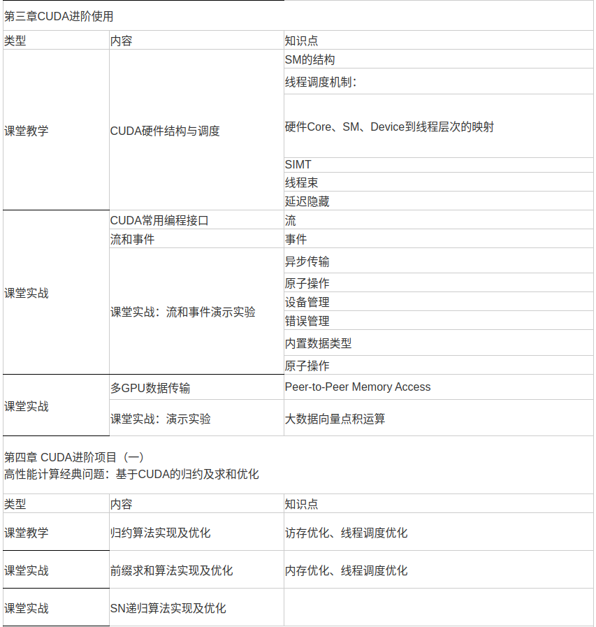

# 猿代码





# CUDA

https://www.bilibili.com/video/BV1GT4y1u77f/?spm_id_from=333.999.0.0&vd_source=bbf01e844b8bfd90a2c891ab672eef2b

P8 编程2

P9 编程3

P11 基本优化

P12 深入优化

## 内置类型和函数

| type         | call   | exec   | 备注                                                                                                                                         |
| ------------ | ------ | ------ | -------------------------------------------------------------------------------------------------------------------------------------------- |
| __global\_\_ | host   | device | 返回值必须为空<br />尽量少用递归<br />不要用静态变量<br />少用malloc：所有线程都会 malloc 的<br />小心通过指针实现的函数调用：指针位置不确定 |
| __device\_\_ | device | device |                                                                                                                                              |
| __host\_\_   | host   | host   |                                                                                                                                              |

### 向量数据类型

```
//  常规数据类型加上[1-4]
int4 vec = make_int4(1, 2, 3, 4)
vec.x == 1
vec.y == 2
```

### 数学函数

sqrt exp sin ... ...

告诉，底精度： __sqrt __exp __sin ... ...

## 线程同步

```
__syncthreads();  // 仅在一个块内同步
```

线程同步小心分支中死锁

## 线程调度

G80：

16 SMs

8 SPs / SM

驻扎 768 threads / SM

同时调度 12288 threads

### warp

同一个 block 中的连续 warpSize 个 threads （64 for capbility 8.6），

运行于同一个 SM，是线程调度的基本单位，warp 内部天然同步。如果 SM 里面 cuda core 不足 warp size，轮流执行，保证同步。

warp 内部分支发散 会执行所有分支。

## 存储模型

| 变量声明                        | 位置     | 作用域 | 生命周期 |
| ------------------------------- | -------- | ------ | -------- |
| 单独的自动变量，不能是数组      | register | thread | kernel   |
| 自动变量数组                    | local    | thread | kernel   |
| __shared\_\_ int sharedvar     | shared   | block  | kernel   |
| __device\_\_ int globalvar     | global   | grid   | app      |
| __constant\_\_ int constantvar | constant | grid   | app      |

### 寄存器 registers

线程专用

快速读写

SM 承载的 threads 会因为 **block 的减少** 而减少

### local memory

存储在 global memory

作用域为每个 thread

存储自动变量数组，通过常量索引访问

### shared memory

快速，片上，全速随机读写和 cache 同级

block shared

### global memory

长延时（100周期数量级）

片外、可读写

随机访问性能差

带宽 100G/s 数量级

### constant memory

短延时、高带宽

device 只读

host 读写

host 访问：

cudaGetSymbolAddress()

cudaGetSymbolSize()

... ...

## 重访

matmul shared mem 瓦片化 暂存数据 减少 global mem 的访问

## 原子函数

排队
atomicAdd()
... ...
atomicCAS()

## 优化

有效的数据并行算法 + 针对GPU架构的特性优化

### 并行规约

例子： reduce_sum
邻近规约 vs 跨步规约
邻近规约 无法释放warp
跨步规约 可以释放warp

### warp分割

warp 是最基本调度单元
warp 切换没有时间成本
1 warp = 32 连续的 thread
减少分支法发散 （同 warp 执行不同 if 分支）

### 存储优化

#### 减少 PCIE 数据传输

PCIE 速度比 GPU 内部数据带宽少 2 个数量级

##### 减少传输

中间数据直接在 GPU 内部分配、操作、释放
有时候更适合在 GPU 进行重复计算

##### 组团传输

latency: 10 ms ～= 80KB / 8GB/s
延迟时间约等于PCIE传输 80KB 数据
避免频繁传输小块数据

##### 内存传输与计算时间重叠

双缓存

##### gloabal mem

warp中的线程 合并访存： 线程号和访存地址规律的连续排列

##### shared mem

速度是 global mem 百倍
通过缓存到 shared mem 减少 gloabal mem 访问次数
线程可以通过 shared mem 协作
预先缓存不满足 合并访存（global mem）条件的数据，在sharemem整理规律，支持合并寻址

##### bank 冲突

shared mem 被分为 banks
bank0  0  16 32
bank1  1  17 33
bank2  2  18 34
... ...
bank15 15 31 47
每个bank 每个周期相应一个地址
连续的地址访问会同时从多个 bank 取数据
对同一个 bank 多次访问会 顺序响应每次访问。后面的需要等待

矩阵转置：如果blocksize == banksize，转置操作中，读或者写总有一方会出现bank冲突，shared mem 的中间矩阵，补上一个列，错开行列可以避免bank冲突

##### texture 纹理

### SM 资源分割

thread block slots
thread slots
registers
shared memory

performance cliff
cuda occupancy calculator

### kernel lunch config

#### grid size 试探法

blocks > SMs : 每个 SM 至少有一个 work 在执行
blocks > 2 * SMs : 多个 block 可以在 SM 上并发执行，互相备用调度
blocks > 100 * SMs : 对未来设备有更好的延展性

#### block size

block size 最好是 warp size 整数倍，避免浪费计算资源
尽量多的 warp 隐藏延时： 最少 64 通常 128 256 block size

#### 延时隐藏

##### 足够多的 warp 来隐藏 global mem 访问

假如 global mem 访问需要 400 cycle，每条算术指令 2 cycle，对于每个 global mem 访问需要 8 指令计算，
那么需要 400 / 2 = 200 算术指令， 200 / 8 = 26 warp

##### 数据预读

global mem 读操作和实际使用数据之间插入去其他数据
预读取下一个 cycle 的数据 （double buffer）

#### 占用率

一个 SM 中 激活 warp 与最大可容纳 warp 比值

#### 指令优化

*2^n -> >>n
% 2^n -> &(2^n - 1)
避免默认double   3.0f
快速底精度版本 func -> __func 或者编译选项 -use-fast-math

#### 循环展开 loop unrolling

```
for (int i = 0; i < BLOCK_SIZE; i++) {
    p += A[x][y] * B[x][y];
}
```

循环分支
循环计数器自加
两次 访存
一次乘
一次加

自动循环展开：

```
# pragma unroll BLOCK_SIZE
for (int i = 0; i < BLOCK_SIZE; i++) {
    p += A[i][y] * B[x][i];
}
变成
p += A[0][y] * B[x][0] + A[1][y] * B[x][1] + A[2][y] * B[x][2] + A[3][y] * B[x][3] + ...;
```

循环分支 没了
循环计数器自加 没了
两次 访存 ： 常量索引没有地址运算
一次乘
一次加

# CUDA 性能分析工具

# cuda conv

https://www.bilibili.com/video/BV1JL411A7yS/?spm_id_from=333.337.search-card.all.click&vd_source=bbf01e844b8bfd90a2c891ab672eef2b

# 流

一个GPU的操作 **队列**

## 支持的并发：

主机和设备计算

主机计算 和 主机设备数据传输

主机设备数据传输 和 设备计算

多设备计算

## 不支持并发

锁页内存分配 a page-locked host memort allocation: 禁用 虚拟内存 swap 等，的 malloc

设备内存分配

设备内存 set

向相同设备内存地址写入

空流，默认流

## 创建和销毁

```
cudaError_t cudaMemcpyAsync(void* dst, const void* src, size_t count, cudaMemcpyKind, cudaStream_t stream = 0);
cudaError_t cudaStreamCreate(cudaStream_t* pStream);
cudaStream_t a;
kernel_name<<<grid, block, sharedMemSize, stream>>>(args);
cudaError_t cudaStreamDestroy(cudaStream_t stream);
```

# CUDA & C++11

https://space.bilibili.com/263032155/channel/collectiondetail?sid=53025
https://www.bilibili.com/video/BV16b4y1E74f/?spm_id_from=333.999.0.0&vd_source=bbf01e844b8bfd90a2c891ab672eef2b

helper_cuda.h
checkCudaErrors()

cudaMencpy 包含一次 cudaDeviceSynchronize

统一内存地址技术 cudaMallocManaged

1:55:49 thread local storage

## 板块 block 与共享内存 1：56：20

### 为什么有 block？ SM(Streaming Multiprocessors) 与 板块(block)

GPU 硬件架构

```

```

```


```

学习 b站 GPU 并行计算和 CUDA 程序开发 https://www.bilibili.com/video/BV1GT4y1u77f
编写第一版简易 cuda 算子库，实现 alexnet 所需算子，完成 alexnet 推理
学习 CUDA_C_Best_Practices_Guide
学习 darknet 和 他的反向传播 实现
编写第二版简易 cuda 算子库，优化算子性能，增加训练能力，完成 alexnet  训练 和 推理


继续学习下去找到算子开发的工作可能性大么？

这个项目是否能帮我找到工作？

学习方向是否正确？

应该偏重哪个方向学习？
